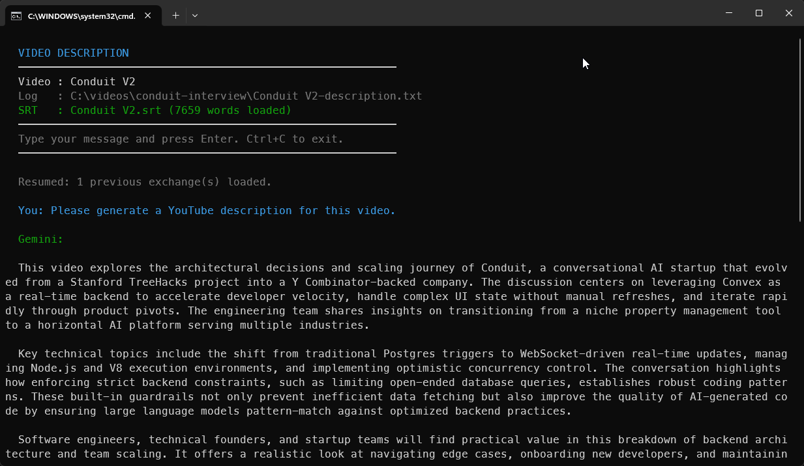

#  video-description

Get a first go at a YouTube description, then chat to tweak it

Windows · macOS

<!-- media: hero

media: hero -->

## What it is

Writing YouTube descriptions is a bit of a chore, so this reads the video's transcript and has Gemini draft one for me. You get a description, timestamps, a resources section, hashtags and a few alternative titles in one go.

Then you can just chat with it to fix things up, like telling it a timestamp is off or asking it to be shorter. The conversation is saved next to the video, so if you run it again later it picks up where you left off.

## Get it

Paste this into your AI coding agent (Claude Code, Codex, Cursor...):

> Clone https://github.com/mikecann/video-description and make it my own. It's one of Mike
> Cann's personal tools, so read the README first, change anything specific to his
> setup to suit mine, then help me get it running.

### Or set it up by hand

You'll need Git, [Bun](https://bun.sh), and an [OpenRouter API key](https://openrouter.ai/keys). The macOS launcher also uses Python 3 to resolve its symlink.

```sh
git clone https://github.com/mikecann/video-description.git
cd video-description
```

Copy `.env.example` to `.env` in this clone and fill in `OPENROUTER_API_KEY`. The CLI reads this file even when you launch it from your video folder. An existing environment variable takes precedence.

On macOS:

```sh
cp .env.example .env
# Edit .env and add your API key.
bash install.sh --with-bun-install
```

The installer links `video-description` into `~/.local/bin`. Add that directory to PATH using the line it prints if needed. You can supply another destination, for example `bash install.sh /your/bin --with-bun-install`. Without `--with-bun-install`, run `bun install --frozen-lockfile` yourself.

On Windows, install Bun with `winget install oven-sh.bun`, then run these from the clone:

```powershell
Copy-Item .env.example .env
# Edit .env and add your API key.
powershell -NoProfile -ExecutionPolicy Bypass -File .\install.ps1
```

The Windows installer runs `deps.ps1`, writes command stubs into `C:\dev\tools`, offers to add that folder to your User PATH, and adds **Video Description** under **Mike's Tools** in Explorer. It creates entries for video files, folders and folder backgrounds. There are no Start Menu or taskbar shortcuts for this CLI. Use `-SkipDeps` if dependencies are already installed, or `-ToolsDir` to choose another stub directory. Keep the clone in a path with ASCII characters for the batch launcher.

Transcription is optional. If you already have a matching `.srt`, nothing else is needed. To generate one from inside the chat, install [transcribe](https://github.com/mikecann/transcribe) separately. On Windows the helper prefers `C:\dev\tools\transcribe.bat`; otherwise it runs `transcribe` from PATH. Its own README covers ffmpeg and transcription dependencies.

## Using it

```sh
video-description "path/to/video.mp4"
video-description "path/to/video-folder"
```

You can also run it directly without installing a launcher:

```sh
bun run index.ts "path/to/video.mp4"
```

On Windows, right-click a video, a folder, or a folder background and choose **Mike's Tools > Video Description**. On Windows 11, choose **Show more options** first.

The tool looks for `<videoname>.srt` next to the video and keeps its timestamps as context. If it is missing, you can run `transcribe` or skip that step and paste a transcript into the chat. If a folder contains several videos, it asks you to pick one.

A new conversation starts with a description request. Chat to revise it, then type `quit` or press Ctrl+C to leave. Each reply is copied to the clipboard when the platform clipboard command succeeds.

On subsequent runs for the same video, the previous conversation is restored and the last exchange is shown.

## Screenshots




## Output

Each exchange is appended as plain text to `<videoname>-description.txt` in the same folder as the video. The latest reply is the version to copy into YouTube Studio.

The transcript and conversation are sent to OpenRouter for the model to process. The tool needs a writable video folder to save the conversation.

## What Gemini produces

Each response is asked to include these sections, in order:

1. **Description**: a short, keyword-rich, third-person summary for developers.
2. **Timestamps**: a `[HH:MM:SS] Title` or `[MM:SS] Title` list based on the transcript.
3. **Resources**: links you provide, or a placeholder to fill in.
4. **Hashtags**: 8 to 15 relevant hashtags.
5. **Titles**: three alternative video titles.

## Iterating

Try messages like:

- `make the description more concise`
- `add a mention of the Convex docs link: https://docs.convex.dev`
- `the timestamps are off, section 3 starts at 4:20`
- `regenerate the hashtags with a focus on TypeScript`

## Model and settings

The default `MODEL` constant in `index.ts` is `google/gemini-3.1-pro-preview`, called through OpenRouter. Edit that constant to use another model. The `SYSTEM_PROMPT` in the same file controls the output style, including the developer focus.

The only required environment variable is `OPENROUTER_API_KEY`. Keep your `.env` private; it is ignored by Git.

## Troubleshooting and uninstalling

If you see `OPENROUTER_API_KEY is not set`, check `.env` in this clone. If Bun cannot resolve packages, run `bun install --frozen-lockfile` here. If `transcribe` is missing, use an existing SRT or install it separately.

Keep the clone after installing, because launchers point to its live files. Re-run the installer after moving it. Changes to existing source files take effect on the next launch.

On Windows, run `powershell -NoProfile -ExecutionPolicy Bypass -File .\uninstall.ps1`, with the same `-ToolsDir` if you used a custom destination. It removes this tool's stubs, icon and Explorer verbs, while preserving the shared submenu, other tools and PATH.

On macOS, remove the `video-description` symlink from the destination you chose, normally `~/.local/bin/video-description`.

## Development

```sh
bun install --frozen-lockfile
bun test
bunx tsc --noEmit
bash -n install.sh video-description
pwsh -NoProfile -File tests/install.Tests.ps1
```

The tests cover clone-local configuration, launcher installation, and transcription command handling without API calls, model downloads or real video files. PowerShell helper tests also check registry preservation on Windows, using an isolated test key. CI runs Bun checks on macOS and parses all PowerShell scripts and tests installer helpers on Windows.

## More tools

My other tools are at [mikerosoft.app](https://mikerosoft.app).

MIT licensed.
